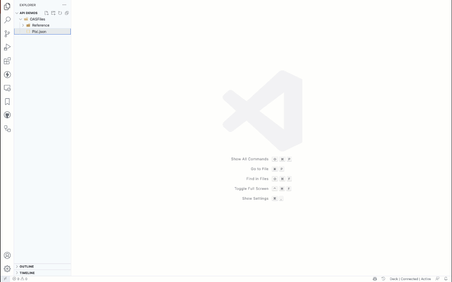
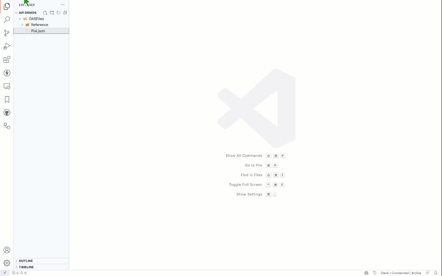
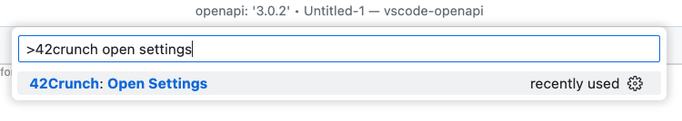
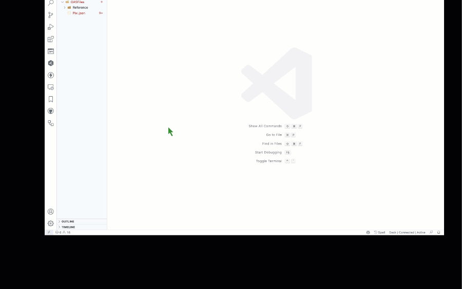
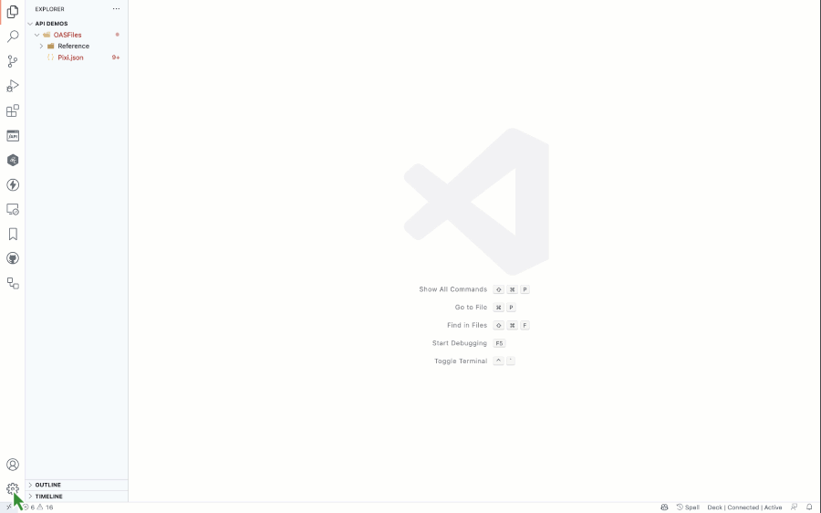

# Installing and configuring the OpenAPI extension for Visual Studio Code

This document describes to install and configure the [VS Code extension](https://marketplace.visualstudio.com/items?itemName=42Crunch.vscode-openapi) 

## Table of contents

- [Installing and configuring the OpenAPI extension for Visual Studio Code](#installing-and-configuring-the-openapi-extension-for-visual-studio-code)
  - [Installing as a free user](#installing-as-a-free-user)
  - [Installing as a platform user](#installing-as-a-platform-user)
  - [Configuring the extension properties](#configuring-the-extension-properties)
  - [Configuring the extension detailed settings](#configuring-the-extension-detailed-settings)

## Installing as a free user
If you do not have a 42Crunch platform account, you can still use the extension to edit OpenAPI files and to run security audits. To do so you simply have to provide an email address in order to receive a license key. Once you receive this key, enter it in the dialog box that appears when you first use the extension.

## Installing as a platform user
If you are a 42Crunch platform user, you can use the extension to edit OpenAPI files and to run security audits and scans, as well as accessing your 42Crunch account. To do so you have to create a token on the 42Crunch platform, and enter it in the dialog box that appears when you first use the extension.

## Configuring the extension properties menu
The primary extensions can be configured using the extension properties menu as follows:

1. To access this menu, click on the gear icon in the bottom left corner of the VS Code window.
1. Press **Ctrl+Shift+P** on Windows or Linux, or **Cmd+Shift+P** on a Mac.
1. In the command prompt, start typing `42Crunch open settings`, and click the corresponding command to create either an OAS v2 or v3 template file.

The following values can be configured:
- Connection details:
  - Platform URL: The URL of the 42Crunch platform, usually https://<i></i>platform.42crunch.com.
  - IDE token: The token to use to access the 42Crunch platform, 
- Service details:
  - Platform services: Whether to autodetect the services URL from the platform URL (the default), or to use a custom URL set below
  - Service URL: The URL of the service to use to run security audits and scans.
- Docker image: Specifies the Docker `scan agent` image to be used. The default is `42crunch/scan-agent:latest`.
- Runtime: specifies whether to use the Docker `scan agent` image, or a `scand manager` URL

## Configuring the extension detailed settings
The extension also has a number of advanced settings which can be configured using the standard VS Code extension settings accessible via the main Settings menu. The following values can be configured:

- openapi.approvedHostnames - a list of hostnames approved for resolving external http:// and https:// references
- openapi.codeLens - show or hide the CodeLens
- openapi.dataDictionaryPreAuditFix - update document to match Data Dictionary definitions before running Security Audit
- openapi.defaultPreviewRenderer - choose Swagger UI or Redoc as the default preview renderer
- openapi.docker - set detailed Docker options
- openapi.platformConformanceScanImage - specify the Docker scan agent image to use
- openapi.platformConformanceScanRuntime - whether to use the Docker scan agent image, or a scand manager URL
- openapi.platformServices - the URL of the 42Crunch platform services
- openapi.platformUrl - the URL of the 42Crunch platform
- openapi.previewUpdateDelay - the preview update delay in milliseconds
- openapi.securityAuditToken - the anonymous security audit token
- openapi.sortOutlines - whether to sort the OpenAPI explorer outline view alphabetically
- openapi.tryit.insecureSslHostnames - list of hostnames TryIt is allowed to connect ignoring SSL certificate errors

