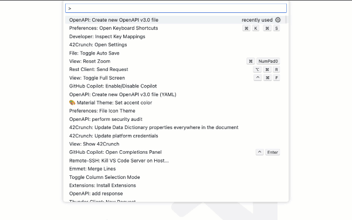
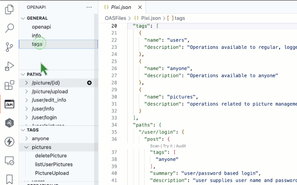
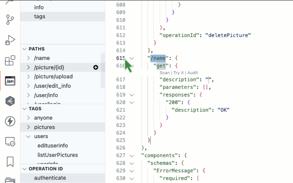
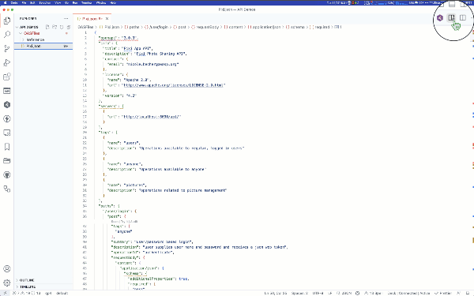
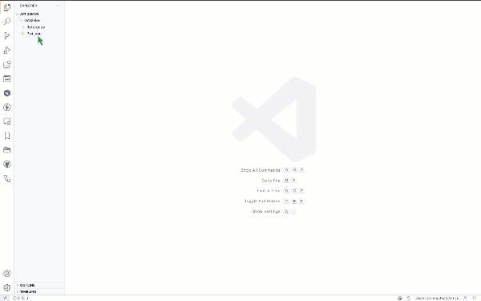
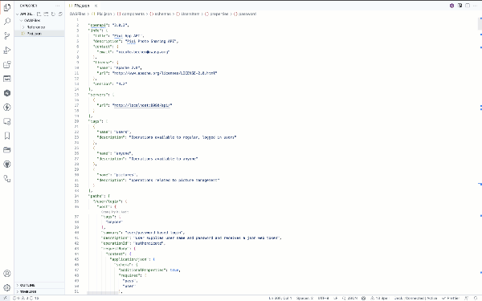
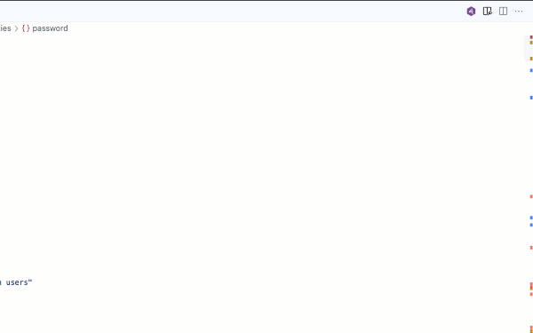
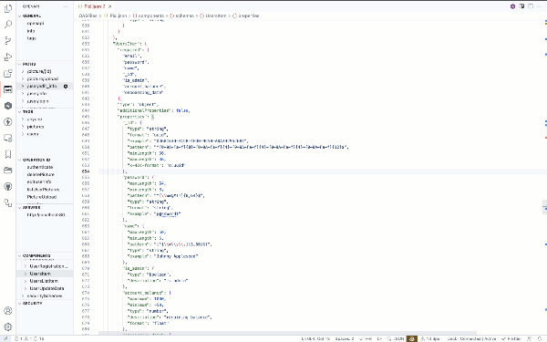

# OpenAPI extension for Visual Studio Code

This [Visual Studio Code](https://code.visualstudio.com/) (VS Code) [extension](https://marketplace.visualstudio.com/items?itemName=42Crunch.vscode-openapi) adds rich support for the [OpenAPI Specification](https://github.com/OAI/OpenAPI-Specification) (OAS) (formerly known as Swagger Specification) in JSON or YAML format. The features include, for example, SwaggerUI and ReDoc preview, IntelliSense, linting, schema enforcement, code navigation, definition links, snippets, static security analysis, and more!

The extension also integrates with [API Security Audit](https://docs.42crunch.com/latest/content/concepts/api_contract_security_audit.htm) and the [API Conformance Scan
](https://docs.42crunch.com/latest/content/concepts/api_contract_conformance_scan.htm) by 42Crunch, so that you can check the quality of your API definition and implementation directly in VS Code.

Both OAS v2 and v3 are supported.

## Table of contents

- [OpenAPI extension for Visual Studio Code](#openapi-extension-for-visual-studio-code)
  - [Table of contents](#table-of-contents)
  - [What's new](#whats-new)
  - [Quickstart](#quick-start)
  - [Installing and configuring the extension](#installing-and-configuring-the-extension)
  - [Editing an API](#editing-an-api)
    - [Working with an OAS file](#working-with-an-oas-file)
      - [Create a new file](#create-a-new-file)
      - [Navigate API definition](#navigate-api-definition)
      - [Add new elements](#add-new-elements)
    - [Preview OpenAPI documentation](#preview-openapi-documentation)
    - ["Try It" API testing](#try-it-api-testing)
  - [Auditing an API](#auditing-an-api)
    - [Audit an entire file](#audit-an-entire-file)
    - [Audit a single operation](#audit-a-single-operation)
    - [Remediating audit findings](#remediating-audit-findings)
  - [API scanning](#api-scanning)
  - [Integration with 42Crunch platform](#integration-with-42crunch-platform)
  - [Known issues](#known-issues)
  - [Feedback](#feedback)

## What's new

This release of the 42Crunch OpenAPI extension for VS Code includes three exciting new features:

* ***Try It API testing*** - You can now test your API directly from VS Code using the *Try It* feature of the extension. The *Try It* feature allows you to send requests to your API and see the responses directly in VS Code. For more information, see [Try It API testing](#try-it-api-testing).

* ***Improved Audit reports*** - The audit reports have been improved to provide more information about the audit findings and allow for filtering of flaws by severity and category, and supports [security quality gate](https://docs.42crunch.com/latest/content/concepts/security_quality_gates.htm) policies. For more information, see [Auditing an API](#auditing-an-api). 

*  ***API conformance scan*** - The extension now allows you to scan your API directly from VS Code using the *Scan* feature. This allows you to scan your API implementation against your API definition and see the results directly in VS Code. For more information, see [Scanning an API](#api-scanning).

* ***42Crunch platform integration***  - If you are a 42Crunch platform user you are now able to view both your [data dictionary](https://docs.42crunch.com/latest/content/concepts/data_dictionaries.htm) definitions and your [API collections](https://docs.42crunch.com/latest/content/concepts/apis_and_collections.htm) directly from VS Code. For more information, see [Integration with 42Crunch platform](#integration-with-42crunch-platform).

## Quick start

After installing the plugin, open any JSON or YAML file that contains an OpenAPI definition in VS Code. The plugin automatically detects that this is an OpenAPI file, and the OpenAPI button  is shown in the left-hand panel. If you have a 42Crunch API key you will additionally have a 42Crunch button  in the left-hand panel.

## Installing and configuring the extension

The extension can be installed from the [VS Code marketplace](https://marketplace.visualstudio.com/items?itemName=42Crunch.vscode-openapi), or from within VS Code itself.

After installing the extension, a new icon  appears in the left-hand panel. Click on it to open the OpenAPI panel.

Before using the extension an API key is required to authenticate the extension to the 42Crunch platform. There are two options to obtain an API key:

1. As a free user you can obtain an API key by merely supplying your email address. Upon entering the key you will be able to use the audit feature of the extension; however the scan feature will be disabled.
2. If you have a 42Crunch platform account (either a community user or a paying enterprise customer), you can use your API key to enable both audit and scan features of the extension.

| User type       | Audit | Scan  | 42Crunch platform |
| --------------- | ----- | ----- | ----------------- |
| Free user       | Yes   | No    | No                |
| Community user  | Yes\* | Yes\* | Yes               |
| Enterprise user | Yes   | Yes   | Yes               |

\* quota limit applies

When prompted, choose how you wish to obtain your API key.

For full installation and configuration details please refer to the separate installation guide [here](./INSTALL.md).

## Editing an API

The OpenAPI extension makes it easier and faster to navigate your OpenAPI definitions, especially when they get longer and more complex.

You can home in on elements in the OpenAPI explorer view, or jump directly to the target of a reference in the API. You can also add new elements to your API directly in the OpenAPI explorer directly where they are needed. Filling in the details is quicker with IntelliSense support for OpenAPI elements.

#### Create a new file

1. Press **Ctrl+Shift+P** on Windows or Linux, or **Cmd+Shift+P** on a Mac.
2. In the command prompt, start typing `new openapi`, and click the corresponding command to create either an OAS v2 or v3 template file.
3. Use the OpenAPI explorer to populate the template with new paths and other elements as needed.
4. Save the file to your disk to fully enable IntelliSense.

#### Navigate API definition

1. Open an OpenAPI file.
2. Click the OpenAPI button to switch to the OpenAPI explorer view.
3. Expand the sections and elements in the file as needed, and click the ones you want to jump to in the editor.

#### Add new elements

1. In OpenAPI explorer pane, go to the section where you want to add a new element, and click the **...** menu.
2. Click the item you want to add from the dropdown list.

### Preview OpenAPI documentation

You can get a documentation-style preview of the API you are editing by clicking the Preview button  at the top right on the editor window bar.

Our extension supports two popular OpenAPI documentation generators: [SwaggerUI](https://swagger.io/tools/swagger-ui/) and [ReDoc](https://github.com/Redocly/redoc).

To change the default OpenAPI Preview rendering engine:

1. On the **File** menu, click **Preferences > Settings**.
2. Expand the **Extensions** section and click **OpenAPI**.
3. Pick the option of your choice from the **Default Preview Rendered** dropdown list.

### "Try It" API testing

The *Try It* feature allows you to test your API directly from VS Code. You can test any API operation, and the extension will automatically generate the request body and the request headers for you. You can also modify the request body and the request headers directly in the *Try It* panel.

1. Hover over the operation you want to test, and click the **Try It** button in the codelens popup.
2. In the *Try It* panel, adjust the parameters for the request to be executed.
3. If the request requires authentication, adjust the values in the **Auth** panel.
4. Click the **Send** button to send the request to the API.

The *Try It* is a new feature, and has some limitations:
- Sending files is not supported
- Try It works best with small textual responses, such as JSON. Binary/image responses will be shown as text

## Auditing an API
You can audit API definitions from within VS Code, either for the entire file or for a single operation. The results of the audit are shown in the OpenAPI explorer view, and you can navigate the audit findings to filter by severity and category. You can also jump directly to the target of an audit finding in the API, and receive further guidance and remediation advice.
### Audit an entire file

To audit an entire file, click the 42Crunch button  in the top right corner of the editor window bar. 

The results can be filtered by the following criteria:
- Security quality gates: only show findings that fail the [security quality gates](https://docs.42crunch.com/latest/content/concepts/security_quality_gates.htm) policy.
- Category: choose All, OpenAPI format requirements, Security or Data validation.
- Severity: choose All, Critical, High, Medium, Low, or Info.
- Rules: choose from the list of rules that were violated.

Further information for each finding is available in the security audit report view, including a description of the finding, an example, possible exploit scenario, remediation advice, and links to further information.

### Audit a single operation

To audit a single operation, hover over the operation you want to test, and click the **Audit** button in the codelens popup. The results can be filtered in the same manner as for an entire file described above.

### Remediating audit findings
Audit findings will be tracked within VS Code as a code flaw, and the standard navigation and remediation shortcuts are supported. 

1. To navigate to a flaw use either the **Next Problem** shortcut, or click on the squiggly line identifying the flaw in the editor.
2. Clicking on the flaw will open the **Problems** panel, where you can see the options available:
    - A description of the flaw in summary form.
    - A link to the full description of the flaw in the security audit report view from where other information is available on remediation.
    - If a *Quick Fix* is available then this option will be shown. Clicking on this provide an option to fix individual flaws, or all flaws at once.
3. Intellisense is available on all elements in the API definition, and will provide suggestions on the supported values appropriate for each element, including values from the associated [data dictionaries](https://docs.42crunch.com/latest/content/concepts/data_dictionaries.htm).

## API Scanning

The *Scan* feature allows you to scan your API directly from VS Code. You can scan any API operation, and the extension will automatically generate the request body and the request headers for you. You can also modify the request body and the request headers directly in the *Scan* panel.

1. Hover over the operation you want to test, and click the **Scan** button in the codelens popup.
2. In the *Scan* panel, adjust the parameters for the request to be executed.
3. If the request requires authentication, adjust the values in the **Auth** panel.
4. Click the **Send** button to commence the scan of the API.
5. The scan will execute with logging in the console window, and the the results with be displayed in the **Scan** panel.

The results can be filtered by the following criteria:
- Show all tests executed under the *Executed* tab.
- Show the issues identified under the *Issues Found* tab.
- Show the issues that are critical/high under the *Critical/High* tab.
- By selecting the *Tests* tabs, it is possible to apply finer grained filters for:
  - Severity: choose All, Critical, High, Medium, Low, or Info.
  - Types: choose from the list of types of issues were identified.

For each finding the following is display:
- The response code and whether that conforms to the expected response code.
- If the Content-Type matched the API contract.
- If the response body matched the API contract.
In addition, for each finding the full request and response is available for investigation, or to recreate the issue.

The *Scan* is a new feature, and has some limitations:
  - TBD

## Integration with 42Crunch platform

If a 42Crunch platform token was provide at installation time, then the extension will automatically connect to the 42Crunch platform and retrieve the API collections and associated APIs and the data dictionaries that are associated with the platform account. This functionality can be accessed via the  42Crunch button  in the left-hand panel.

For the [data dictionary](https://docs.42crunch.com/latest/content/concepts/data_dictionaries.htm), the viewer will show all the data dictionaries and their elements in a read-only view.

For the [API collections](https://docs.42crunch.com/latest/content/concepts/apis_and_collections.htm) view, the viewer will show all the API collections and their associated APIs. By double-clicking the API definition or report you can load the item into an editor window, and make changes which will be saved back to the platform. This will trigger an re-run of the audit with the new results reflected in the report. 

## Known Issues

TBD

## Feedback

When you have a minute **PLEASE** submit your feedback and feature requests at [this superquick survey](https://www.surveymonkey.com/r/L7R69JR).

Submit your bug reports at [GitHub project Issues](https://github.com/42Crunch/vscode-openapi/issues).

And, needless to say, your reviews at [VS Code marketplace](https://marketplace.visualstudio.com/items?itemName=42Crunch.vscode-openapi&ssr=false#review-details) mean the world to us!
