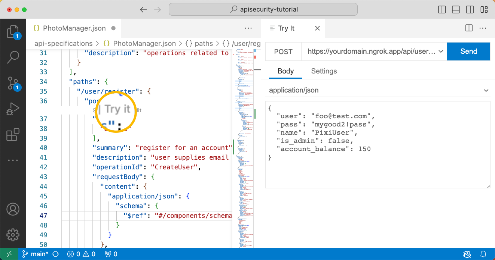
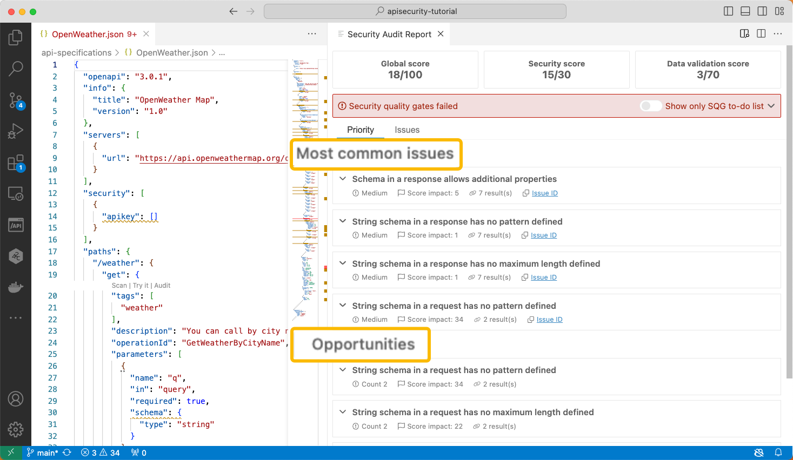
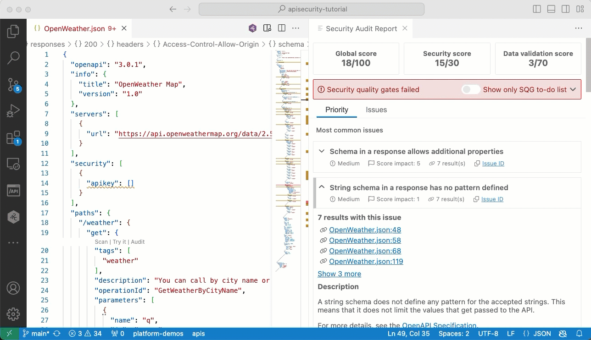

# OpenAPI Editing with API quality, Conformance and Security Testing

Rich support for the OpenAPI Specification (OAS) / Swagger specification making it quicker and easier to create, edit and navigate your OpenAPI definitions.

Also check the quality, conformance and security of your APIs from inside VS Code, with the bundled 42Crunch API security testing tools - [API Audit](#activating-api-audit) and [API Scan](#activating-api-scan). Audit and Scan are available to both our freemium users and to 42Crunch platform subscribers. Monthly usage limitations apply for freemium users. [Upgrade options](https://42crunch.com/single-user-pricing/) available.

## OpenAPI Editing

The plugin supports code navigation, linting, SwaggerUI or ReDoc preview, IntelliSense, schema enforcement and generation, schema definition links and snippets.
It also supports both OpenAPI v2 and v3.0.x in JSON or YAML format. [QuickStart](#quick-start)

- [Creating OpenAPI files](#creating-openapi-files)
- [Navigating an API definition](#navigating-an-api-definition)
- [Add new elements](#add-new-elements-in-the-openapi-explorer)
- [Use IntelliSense](#use-intellisense)
- [Jump to a reference](#jump-to-a-reference)
- [Sort entries in the navigation pane](#sort-entries-in-the-navigation-pane)
- [Preview OpenAPI documentation](#preview-openapi-documentation)
- [Execute operations with "Try it"](#execute-operations-with-try-it)
- [Generate JSON schemas based on the response content](#generate-json-schemas-based-on-the-response-content)
- [Configure authentication for external references in OpenAPI files](#configure-authentication-for-external-references-in-openapi-files)
- Split your OpenAPI into multiple files linked via $ref
- Use quick fixes to automatically resolve problems in your OpenAPI
- Use Code snippets to add paths, operations, components, security

## Activating API Audit

A static analysis that lets you check the quality, conformance (to the OpenAPI specification) and security of your API definition. [Video explainer](https://vimeo.com/873235173)

- [Running an audit](#running-an-audit)
- [Navigating the issues in the audit report](#navigating-the-issues-in-the-audit-report)
  - [Priority issues](#priority-issues)
  - [Full issue list](#full-issue-list)
- [Issues details](#issues-details)
- [Fixing issues](#fixing-issues)

## Activating API Scan

A dynamic conformance and security tool that tests the API for conformance to the API definition and security vulnerabilities. The free version of API Scan runs locally in your own environment and does not require your API to be uploaded to the 42Crunch platform.
[Video explainer](https://vimeo.com/884864394/b167153ec4)

- [Conformance to the API Definition](#new-dynamic-api-security-testing)
- [Launching the Scan](#launching-42crunch-scan)

The free version of API Scan runs locally in your own environment and requires no API file to be uploaded.

## Freemium

This service lets users of our OpenAPI editor extension who are not customers run the API Audit and Scan tests on their APIs.

- [Getting a Freemium Token](#getting-a-freemium-token)

## Support and Documentation:

We’ve recently launched our developer community where you’ll be able to help, get tips-n-tricks and keep up to speed with all the latest developments: https://developers.42crunch.com/

## Quick start

After installing the plugin, open any JSON or YAML file that contains an OpenAPI definition. The plugin automatically detects that this is an OpenAPI file, and the **/API** button is shown in the left-hand panel.

We also encourage you to watch [this video](https://42crunch.com/tutorial-openapi-swagger-extension-vs-code/#Introducing-OpenAPI-Editor) that gives you a full tour of the editor and its different features.

## Editor features

This extension makes it easier and faster to navigate your OpenAPI definitions, especially when they get longer.

You can home in on elements in the OpenAPI explorer view, or jump directly to the target of a reference in the API. You can also add new elements to your API directly in the OpenAPI explorer directly where they are needed. Filling in the details is quicker with IntelliSense support for OpenAPI elements.

### Creating OpenAPI files

1. Press **Ctrl+Shift+P** on Windows or Linux, or **Cmd+Shift+P** on a Mac.
2. In the command prompt, start typing `new openapi`, and click the corresponding command to create either an OAS v2 or v3 template file.
3. Use the OpenAPI explorer to populate the template with new paths and other elements as needed.
4. Save the file to your disk to fully enable IntelliSense.

 Watch this [video](https://42crunch.com/tutorial-openapi-swagger-extension-vs-code/#Navigating-OpenAPI-Explorer) on editor basics.

### Navigating an API definition

1. Open an OpenAPI file.
2. Click the OpenAPI button to switch to the OpenAPI explorer view.
3. Expand the sections and elements in the file as needed, and click the ones you want to jump to in the editor.

### Add new elements in the OpenAPI explorer

1. In OpenAPI explorer pane, go to the section where you want to add a new element and right-click on the relevant node to open a context menu.
2. Click the item you want to add from the list.

### Use IntelliSense

As you start typing OpenAPI elements or their values, the context-sensitive list of available options is displayed in the IntelliSense menu. In JSON OpenAPI files, just type double-quote (`"`) to show the menu, and type further to filter the list. In YAML OpenAPI files, start typing the property name.

You can also use the corresponding VS Code hotkey (**Ctrl+Space** on Windows, **Cmd+Space** on Mac) to open the IntelliSense menu.

### Jump to a reference

Use Go to Definition to locate the targets of references easily. To jump to view the definition from a reference in your API, either **Ctrl+click** a reference, or right-click a reference and click **Go to Definition** in the shortcut menu.

### Sort entries in the navigation pane

By default, entries in the OpenAPI Explorer pane are sorted alphabetically. If you want to instead have them sorted in the order they are in the OpenAPI file, change the corresponding setting:

1. On the **File** menu, click **Preferences > Settings**.
2. Expand the **Extensions** section and click **OpenAPI**.
3. Clear the checkbox **Alphabetically sort contents of OpenAPI explorer outlines**.

### Preview OpenAPI documentation

You can get a documentation-style preview of the API you are editing by clicking the Preview button  at the top right:

The extension supports two popular OpenAPI documentation generators: [SwaggerUI](https://swagger.io/tools/swagger-ui/) and [ReDoc](https://github.com/Redocly/redoc).

To change the default OpenAPI Preview rendering engine:

1. On the **File** menu, click **Preferences > Settings**.
2. Expand the **Extensions** section and click **OpenAPI**.
3. Pick the option of your choice from the **Default Preview Rendered** dropdown list.

### Execute operations with "Try it"

With "Try it", you can invoke operations defined in your OpenAPI directly from VS Code:

- Click on "Try it" code lens which is displayed right below the HTTP verb (e.g. "get", "post") of your operation and in the examples section.
- The payload data will be generated based on the request JSON Schema, or the first example available. You can edit this information before sending the request.

Try it comes with a number of limitations:

- Sending files is not supported
- It works best with text-based responses, such as JSON
- Binary/image responses will be shown as text

### Generate JSON schemas based on the response content

"Try it" can be used to generate JSON Schema based on the body of the response.

- Select "Tools" tab in the TryIt response
- Click "Generate schema" button.

### Configure authentication for external references in OpenAPI files

If you use references to schemas served by an authenticated HTTP service (such as an Schema Registry service or a repository), you'll need to configure the list of approved hosts in the extension settings. To do this:

1. On the **File** menu, click **Preferences > Settings**.
2. Expand the **Extensions** section and click **OpenAPI**.
3. Locate the **Openapi: Approved Hostnames** setting, click on **Add item**, and write the hostname you need for resolving external references.
   

In case some of the approved hosts requires authentication, you can configure it in the OpenAPI > External References section of the `42Crunch: Open Settings` command view:

 

> To open this view, go to `View > Command Palette...` in VSCode menu and type in `42Crunch`, you'll see the Open Settings command listed below:
> 
> You can also use keyboard shortcuts for the Command Palette **Ctrl+Shift+P**, or **Cmd+Shift+P** for Mac users.

 

After configuring all hosts you need to refer to, all OpenAPI references to any of the approved hosts will be dynamically resolved when linting or previewing your API.

## Static API Security Testing

You can use this OpenAPI extension to check the quality and security of your API definition as you work on it. This feature is powered by 42Crunch [Audit](https://docs.42crunch.com/latest/content/concepts/api_contract_security_audit.htm?utm_campaign=IDE&utm_medium=referral&utm_source=vscode). 42Crunch Audit performs a static analysis of the API definition that includes more than 300 checks on best practices and potential vulnerabilities related to authentication, authorization as well as data constraints.

 Watch this [video](https://42crunch.com/free-user-faq/#Free-API-Security-Testing-FAQs-00) to learn more about 42Crunch Audit.

You can run the audit service in freemium or platform mode:

- **Using our freemium centralized service**: this service is a fully featured version of the audit, but with usage limits. In this mode, OAS files are sent to the service, audited and a report is returned. This is a stateless service: **we do not keep the OpenAPI file, nor the report.**
- New! **Using the 42Crunch CLI**: in this mode, audits are performed locally (on the user's machine). This is only available to <u>freemium</u> users for now. Support for local audit/scans using a platform API token will be available soon. In this mode, **OpenAPI files and reports are kept locally**.
- **Using 42Crunch SaaS platform**: this requires an account on a 42Crunch platform, which is available to customers and to prospects evaluating our product. In this case, you need to supply your platform URL and an IDE token (which can be created from the platform home page). You can specify those settings by invoking `42Crunch: Update platform credentials` from the command palette.

### Getting a Freemium Token

To run Security Audit from VS Code, you need a token. The first time you try to audit or scan an API, you are asked to provide your email address or an API token from the platform.

Once you supply the address, the extension requests the token to be sent to your mailbox. Paste the token you received in the prompt in VS Code, and you are all set.

Watch this short [video](https://42crunch.com/free-user-faq/#Free-API-Security-Testing-FAQs-02) which takes you through those steps.

### Running an audit

You can use OpenAPI extension to check the quality of your API as you work on it. You can run the audit directly from VS Code by clicking the Audit button in the toolbar. Alternatively, you can run an audit for an individual endpoint using the code lens.

### Navigating the issues in the audit report

After the audit finishes, you get the audit report directly in the VS Code view, side by side with your code. The report viewer provides handy ways to navigate the found issues, even if the report is quite long.

#### Priority issues

Look here for issues that require the most attention.

- **Most Common issues**: this list contains issues that are occuring the most, and how many times they are repeated.
- **Opportunities**: this list contains issues that, if fixed, will most contribute to raise the audit score.

Those two lists will often overlap and in certain cases be identical, but this is totally normal.

#### Full issue list

The full issue list contains all issues found. The list can be filtered in two ways:

- **Using the security gate (SQG) toggle**: an SQG enforces enterprise compliance and hightlights issues that are offending the requirements established, such as a minimal score, issues severity or specific issues (e.g. an API key is used when only OAuth is allowed across the enterprise). When the toggle is on, only the issues affecting the SQG status are shown.

 SQG results are not visible yet to all Freemium users.

- **Using the filtering options**: you can also use filtering options to drill-down into the list such as severity, category or even a specific issue type.

#### Issues details

For each issue, you have access to full information about the issue, why it is relevant and recommendations on how to address the issue.

 Watch this [video](https://42crunch.com/free-user-faq/#Free-API-Security-Testing-FAQs-2) to learn more about audit and how to navigate issues.

### Fixing issues

Many of the issues reported by 42Crunch Audit have fixes associated with them. These are code snippets that you can insert into the OpenAPI file and then customize with the appropriate value.

1. Cick some of the error lines in your OpenAPI file to bring up the QuickFix blue icon on the left of the line.
2. Click the Quickfix icon and select the fix to apply.
3. Tweak the values in the inserted code snippet as you see fit.

## (New!) Dynamic API Security testing

42Crunch Audit performs a security analysis that does not require any live API, just the definition itself. 42Crunch Scan leverages the OpenAPI definition to:

- Test the resilience and behavior of APIs by automatically generating security tests from the APIs' OpenAPI definition. Scan reproduces the typical behavior of a hacker by injecting bad payloads, bad tokens, and using invalid HTTP verbs and paths. This helps detect vulnerabilities early in the API life cycle, especially those associated with the [OWASP API Security Top 10](https://apisecurity.io/owasp-api-security-top-10/owasp-api-security-top-10-project/).
- Validate that the implementation of the API conforms to its established contract: Scan checks all responses against the OpenAPI definition and detects unexpected responses and data leaks.

 Watch this [video](https://42crunch.com/free-user-faq/?utm_campaign=IDE&utm_medium=referral&utm_source=vscode#Free-API-Security-Testing-FAQs-4) to learn more about 42Crunch Scan.

APIs which thoroughly enforce compliance to an established contract are far more resilient to all types of attacks.

 You must only use 42Crunch Scan against APIs that you own, not those of third parties.

### Launching 42Crunch Scan

We recommend you use the 42Crunch API Security Testing Binary to run scans. The alternative is to run a docker image locally. 42Crunch customers can also leverage our [scand manager](https://github.com/42Crunch/scand-manager), by deploying an API-driven scan engine on Kubernetes.

In order to run a scan, you will need :

- **A credential** : most likely, your API is using some form of authentication, like an API Key or token. You need a valid credential to provide to the scan engine.

- **The URL** when the API is deployed.

   We strongly recommend that you do <u>not</u> target a production system. While the tool does not try to inject malicious payloads, it is possible that the API implementation is not resilient enough to handle the tests and may crash or behave unexpectedly.

When you first launch a scan, you are presented with the scan configuration viewer. The scan configuration is generated automatically from the OpenAPI file you chose to scan.

- For each operation in the OpenAPI file, a request is created. You can test individual requests using the **Try** button top-right.

  

- Requests can be arranged into testing scenarios: a scenario combines one or multiple requests, for example you need to create a resource before you can view it. The editor allows you to extract data as variables from a request execution to inject it into the next step.

  Similarly to requests, you can test an individual scenario to ensure it is built correctly before starting a scan: the scan engine will execute the scenario and if successful, launch automatically dozens of tests using the data provided in the OpenAPI file. The scan will send bad verbs, bad data types, bad data formats as well as authentication tests.

  

Once the scan has run, you are presented with a results page. The summary shows if the scan got a testing baseline by running the HappyPath test. Additional testing results are visible from the tests list. For each issue, you can easily reproduce the problem using a curl request.

## Miscellaneous commands

- You can load results of Security Audit from a file for a currently open OpenAPI file by running command `42Crunch: Load Security Audit report from file` from the command palette

## Network requirements

To execute the 42Crunch Freemium services, you need access to the following URL: https://stateless.42crunch.com. You may need to ask your administrators to add a firewall rule to allow the connection.

## Known issues

- For new files, IntelliSense does not work until you save the file. File extension must be `.json` or `.yaml`.
- When running 42Crunch Scan on a host with incorrect clock, the scan can fail with the message `cannot send the scan report : rpc error: code = InvalidArgument desc = invalid input`, to resolve the issue make sure your clock is correctly set.

## Feedback

Submit your bug reports at [GitHub project Issues](https://github.com/42Crunch/vscode-openapi/issues).

And, needless to say, your reviews at [VS Code marketplace](https://marketplace.visualstudio.com/items?itemName=42Crunch.vscode-openapi&ssr=false#review-details) mean the world to us!
