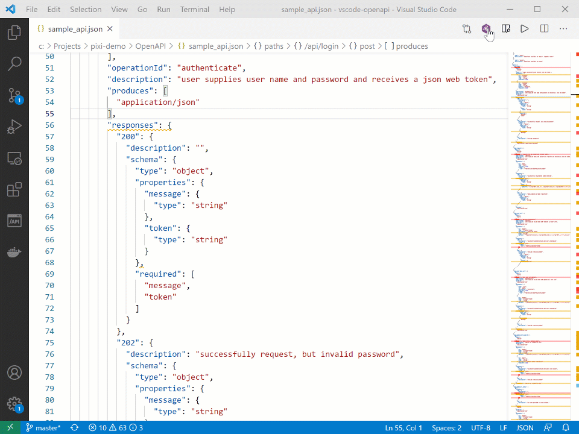
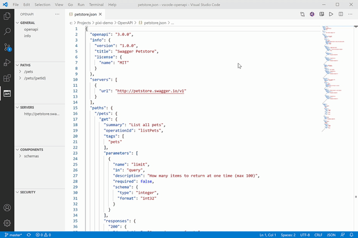
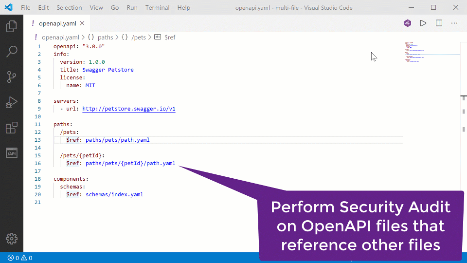

# What's new in OpenAPI (Swagger) Editor version 4.0

## QuickFixes for security issues found by Security Audit

The extension now not only locates but also helps fix security issues in your OpenAPI definition.

### Individual fixes:
1. Perform the Security Audit by clicking the **42c** button.
2. When you click some of the error lines in your OpenAPI file, you will see the QuickFix icon show up on the left of the line.
3. Click the icon and select the QuickFix to apply.
4. Tweak the values in the inserted code snippet as you see fit.

### Bulk fixes:

If your OpenAPI file contains multiple similar issues - for example, a parameter with the same name is missing the pattern definition - you can fix all such occurrences in one go:
1. Fix the first occurrences and supply the proper values in the code snippet.
2. Go to the next occurrences and use the bulk QuickFix. This bulk QuickFix will reuse the values that you used previously for the parameter with the same name.

## HTML Preview Pane 

You can get a documentation-style preview of the API you are editing by clicking the Preview button  at the top right:

## Support for external HTTP references

OpenAPI definition files can be composite with parts of the API definition stored in external files and referenced in the main file using the `$ref` notation. We now support not only local component files but also ones referenced with HTTP/HTTPS URLs. 

For security reasons, the domains from which you want such component files to be downloaded should be added to the **Approved Hostnames** list in the extension's setting. 

# What's new in OpenAPI (Swagger) Editor version 3.0

Security Audit now supports composite OpenAPI files.

42Crunch API Contract Security Audit is a static application security testing (SAST) service that OpenAPI (Swagger) Editor invokes for the OpenAPI file currently opened in VS Code when you click the **42c** button at the top right. The extension sends the file to the remote service that performs 200+ security checks, and sends back a report that is rendered in VS Code.

However, OpenAPI definiton files can be composite. In that case, parts of the API definition (for example, schemas for shared payloads types) can be stored in external files and referenced in the main file using the `$ref` notation.

Starting with OpenAPI (Swagger) Editor v3.0, such composite OpenAPI files are fully supported, including auditing. Simply open the main OpenAPI file (JSON or YAML), and click the **42c** button at the top right. The extension  automatically finds and parses all `$ref` references, locates the possible references in other files, aggregates the referenced information in the API contract, and runs the audit for it.

**Note**: When dealing with composite API definitions, you should invoke Security Audit from the main (parent) file that contains the actual API definition. The shared component files (children) might not follow the requirements of the OpenAPI Specification (OAS) to the full, and thus the extension might not detect them as OpenAPI files. The OpenAPI-specific functions (such as audit, schema checks, outline, and code completion) would not be available for such files.

# What's new in OpenAPI (Swagger) Editor version 2.0

We have updated our OpenAPI extension to version 2.0. This is a major release with the Security Audit getting to where we wanted it to be for its initial scope and a few other improvements.

- [What's new in OpenAPI (Swagger) Editor version 4.0](#whats-new-in-openapi-swagger-editor-version-40)
  - [QuickFixes for security issues found by Security Audit](#quickfixes-for-security-issues-found-by-security-audit)
    - [Individual fixes:](#individual-fixes)
    - [Bulk fixes:](#bulk-fixes)
  - [HTML Preview Pane](#html-preview-pane)
  - [Support for external HTTP references](#support-for-external-http-references)
- [What's new in OpenAPI (Swagger) Editor version 3.0](#whats-new-in-openapi-swagger-editor-version-30)
- [What's new in OpenAPI (Swagger) Editor version 2.0](#whats-new-in-openapi-swagger-editor-version-20)
  - [API Security Audit](#api-security-audit)
    - [Navigate the issues in the audit report](#navigate-the-issues-in-the-audit-report)
    - [Jump to the line in the code](#jump-to-the-line-in-the-code)
    - [Navigate back to full report](#navigate-back-to-full-report)
    - [Submit feedback](#submit-feedback)
  - [Other improvements](#other-improvements)
    - [API navigation extended to parameters and responses](#api-navigation-extended-to-parameters-and-responses)
    - [API navigation no longer disappearing while API is being edited](#api-navigation-no-longer-disappearing-while-api-is-being-edited)

## API Security Audit

OpenAPI Security Audit is a static analysis of OpenAPI files. The service *does not* call the actual API endpoint. It simply looks at the OpenAPI file itself and checks if it is following industry security best practices.

The checks that are run are derived from the [API Security Encyclopedia at APISecurity.io](https://apisecurity.io/encyclopedia/content/api-security-encyclopedia.htm).

**To run Security Audit for the currently opened OpenAPI file:**
- Click the **42c** button at the upper right of the OpenAPI file you are editing.

Note:
- To run Security Audit from VS Code, you need a token. On the first time, you are asked to provide your email address. When you supply the address, the extension requests the token to be sent to your mailbox. Once you get the token, paste it in the prompt in VS Code, and you are all set. From now on, all you need to do is to click the button to run the audit.

### Navigate the issues in the audit report

After the audit finishes, you get the audit report directly in the VS Code view, side by side with your code. Depending on your API definition, the report might be long, so here are some handy ways to navigate the found issues.

1. To scroll through all issues and their details, use the text panel on the right.

2. Hover on an element that is underlined or marked with three dots (recommendations) in your code to see what the issues in that spot are. If you click on view the descriptions of only these issues, the rest of details are filtered out from the text panel, so you have less to scroll through.

3. For a quick overall look, check the counts in the Status Bar. The different icons match the severity of the issue:
  - Error: critical or high 
  - Warning: medium
  - Info: low

4. Click the icons in the Status Bar to open the PROBLEMS panel and scroll through the issue titles. The issues are ordered from most to least severe, so it is easy for fix the worst offenders first. Note that recommendations are not listed in the PROBLEMS panel.
5. Click on an issue in the PROBLEMS panel to jump to view it inline in your API definition.

### Jump to the line in the code

We have added the ability to jump to the specific place in the API definition for each error. To do this, simply click the hyperlink in the report.

### Navigate back to full report

When you read Security Audit information for a particular issue, you can now jump back to the full security audit report by clicking the **Go back to full report** link at the bottom of the article.

### Submit feedback

Security Audits can be tricky. If you believe that the static analysis misinterpreted your API definition, missed something, or provided a description or mitigation advice that can be improved, click the **Please submit your feedback for the security audit [here](https://github.com/42Crunch/vscode-openapi/issues)** link at the top of the full report and submit a GitHub ticket.

## Other improvements

### API navigation extended to parameters and responses

API navigation tree used to only go 2 levels deep: to paths and operations. You can now go down two levels more: to specific parameters and responses.

### API navigation no longer disappearing while API is being edited

As you edit OpenAPI files they temporarily become invalid from OpenAPI schema requirements perspective. In the past, this temporarily removed the API navigation tree entirely.

We have now improved the usability and keep the current tree even when the schema is temporarily wrong. This means that you still see which elements your API has.

Note: we still remove the ability to add new elements from the API navigation pane menu until your OpenAPI file becomes a proper JSON/YAML file again and we can build the live navigation model.
